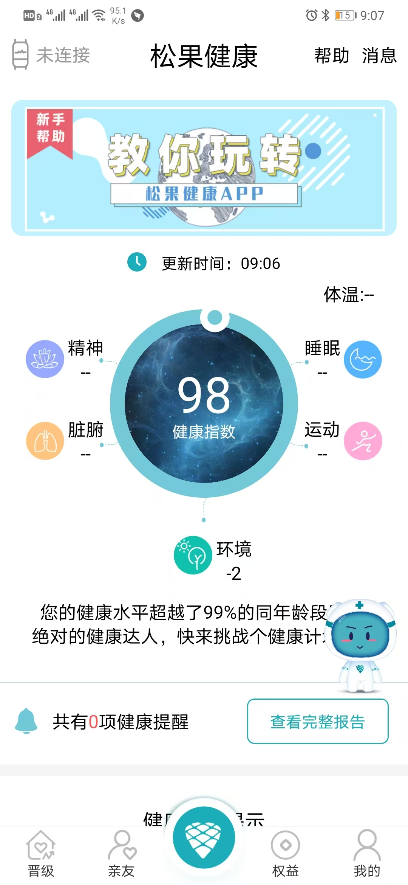
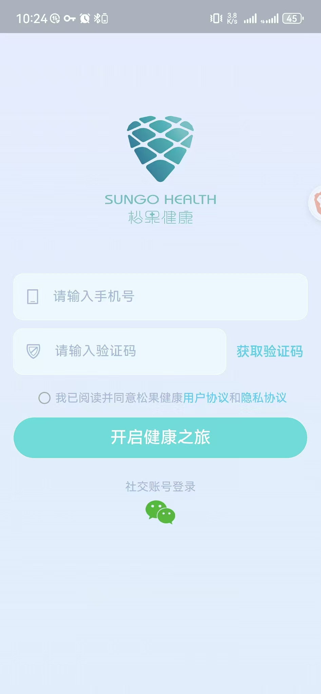
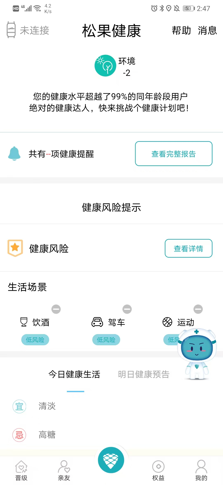

# Sungo Health (松果健康)

> Commercial Android App + Smart Band Integration  
> Client: Beijing Zhengqihe Health Technology | Status: Live

## Overview

Sungo Health is an intelligent personal health management application. It connects to SUNGOD smart bands via Bluetooth, collects real-time body metrics, and presents a visualized multi-dimensional health index.

**Platform:** Android  
**Language:** Java  
**Hardware:** SUNGOD Smart Band  
**Architecture:** Package-based componentization

## Key Features

- Circular health dashboard (0–100 score) with 6 dimensions
- BLE connection + real-time data sync + firmware OTA
- Blood pressure measurement & calibration flow
- Weekly / monthly health reports
- Automatic health risk detection
- Content center (7 categories)
- Social & membership system
- Phone + WeChat login

## Technical Highlights

- Fully **custom Canvas-drawn** health dashboard (no third-party chart library)
- Complete BLE GATT architecture (scan, connect, data channel, reconnect, OTA)
- Six-dimensional health index model + risk recognition engine
- Clean package-level componentization for parallel development

## Tech Stack

| Category | Technology |
|----------|------------|
| Language | Java |
| Architecture | MVC + Componentization |
| Bluetooth | BLE GATT + custom protocol |
| Network | OkHttp / Retrofit + Gson |
| Storage | MMKV / SQLite |
| Visualization | Custom View (Canvas) |
| Login | SMS + WeChat Open Platform |
## Screenshots

## Team

Developed by **HansonForge**.

## Note

This repository is for portfolio demonstration. Sensitive business logic, API endpoints, and user data have been removed or anonymized.

---

**HansonForge** — Professional Software Development Team  
Available for IoT / Health / Wearable / BLE projects.
